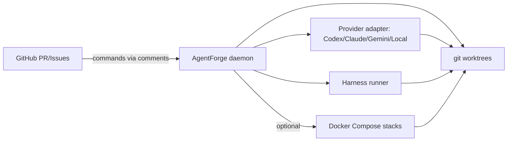

# Architecture overview

AgentForge is a “local-first” orchestration layer for coding agents.

The key design goal is to support **parallel agent throughput** without:
- branch collisions,
- runtime collisions,
- or chaotic integration.

## Core primitives

### 1) Workspaces = `git worktree`
Each task is executed in its own git worktree:
- separate directory
- separate branch
- shared git object database

This allows multiple tasks to run in parallel on one machine.

### 2) Optional runtime stacks
If your repo needs a running stack (web + API + DB), AgentForge can start one
stack per workspace using Docker Compose project scoping + per-workspace ports.

### 3) Provider adapters
AgentForge does not “own” any one AI provider. A provider is just:
- “given a prompt + cwd, run the agent”
- in a controlled environment

The Codex CLI provider shells out to `codex exec`.

### 4) Policy-as-code
Automation is governed by a `policy.toml`.
In “fast” mode, it should run smoothly without repeated approvals.
Tripwires stop automation on:
- high-risk path changes (e.g. `.github/workflows/`)
- suspicious diff patterns (e.g. `curl | sh`)
- policy violations

### 5) Event-driven automation
AgentForge can be driven by:
- local polling (simplest, safest)
- GitHub Actions “wake” events (optional)
- a webhook receiver (future)

---

## High-level component diagram (Mermaid)

---

## Why this approach scales

- Worktrees scale linearly until you saturate CPU/RAM, without repo duplication.
- Runtime stacks only spin up per workspace when necessary.
- Providers are plug-ins, so switching LLMs doesn’t rewrite the control plane.
- Policies are repo-local and versionable.
