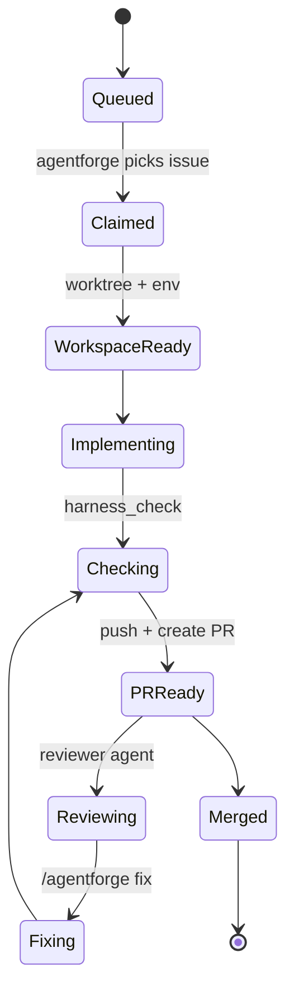
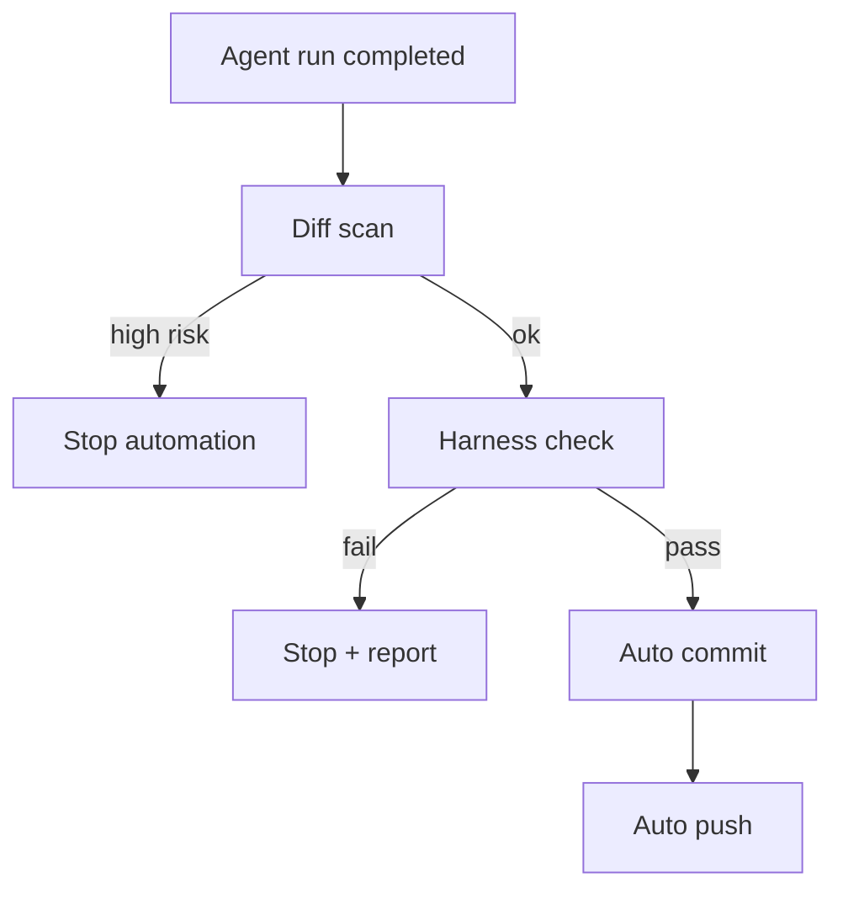

# Diagrams (Mermaid)

## Task lifecycle

```mermaid
stateDiagram-v2
  [*] --> Queued
  Queued --> Claimed: agentforge picks issue
  Claimed --> WorkspaceReady: worktree + env
  WorkspaceReady --> Implementing
  Implementing --> Checking: harness_check
  Checking --> PRReady: push + create PR
  PRReady --> Reviewing: reviewer agent
  Reviewing --> Fixing: /agentforge fix
  Fixing --> Checking
  PRReady --> Merged
  Merged --> [*]
```

## Policy gates

```mermaid
flowchart TD
  A[Agent run completed] --> B[Diff scan]
  B -->|high risk| STOP[Stop automation]
  B -->|ok| C[Harness check]
  C -->|fail| STOP2[Stop + report]
  C -->|pass| D[Auto commit]
  D --> E[Auto push]
```
